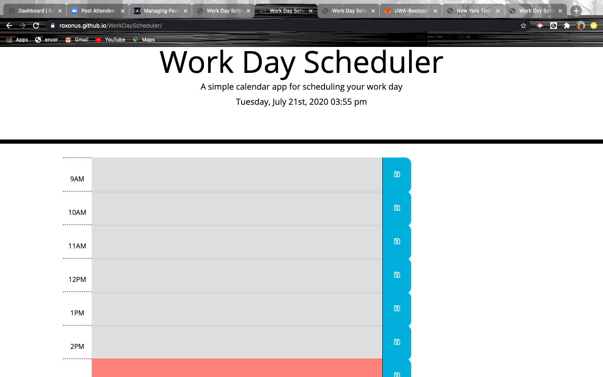

# WorkDayScheduler
https://roxonus.github.io/WorkDayScheduler/

This is an easy to use day planner where you can save your to do list throuout the work day. The time blocks are color coded to let you know what hour of the day it is, currently, and the time and date is posted at the top of the page.
